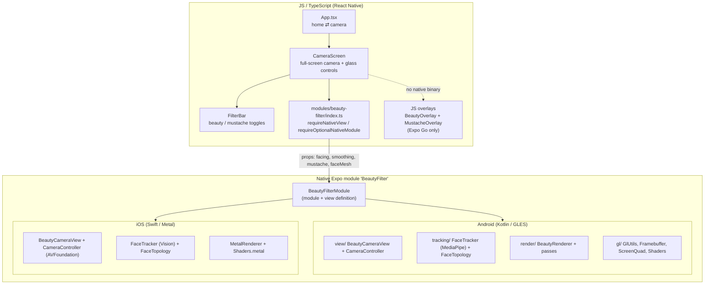
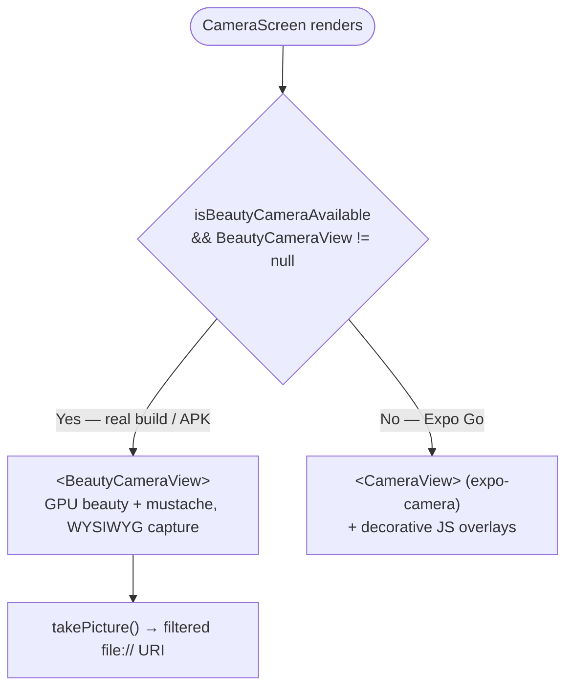
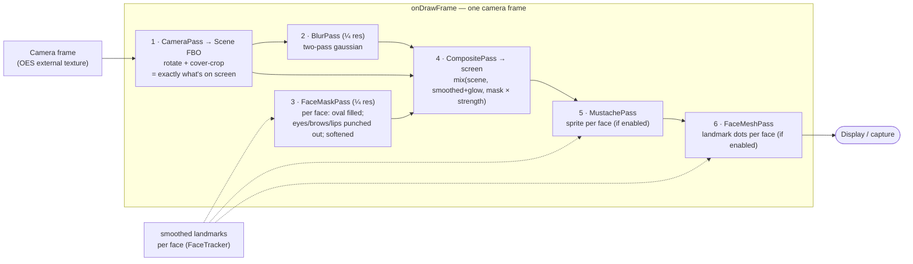
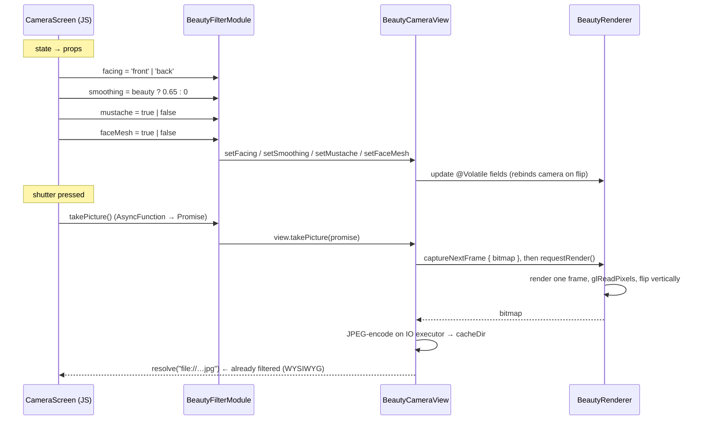

# FilterCam — Architecture

FilterCam is an Expo (React Native) camera app whose real work happens in a
**local Expo native module** (`modules/beauty-filter`). The JS side is a thin UI
shell; the native side owns the camera, face tracking, and a GPU render pipeline
that applies a face-only beauty filter, a landmark-anchored mustache, and an
optional face-mesh debug overlay in real time.

- **Platforms:** Android (Kotlin + OpenGL ES) and iOS (Swift + Metal + Vision).
  Both implement the same JS-facing contract; the Android side is the reference.
- **JS ↔ native contract:** a single `<BeautyCameraView>` component (props
  `facing`, `smoothing`, `mustache`, `faceMesh`) plus a `takePicture()` method,
  wired through the Expo Modules API.
- **Multi-face:** up to 5 faces are tracked and filtered at once.

---

## 1. Layers at a glance



**Key files (Android)**

| File | Responsibility |
|------|----------------|
| `App.tsx` | Two-screen switch (home ⇄ camera), no router |
| `src/screens/CameraScreen.tsx` | Permissions, filter state, full-screen camera, glass (blur) controls, face-mesh toggle |
| `src/components/FilterBar.tsx` | Beauty / Mustache toggle chips |
| `modules/beauty-filter/index.ts` | JS view/module bridge + `isBeautyCameraAvailable` |
| `…/beautyfilter/BeautyFilterModule.kt` | Declares module name, props, `takePicture` (wiring only) |
| `…/beautyfilter/view/BeautyCameraView.kt` | ExpoView; hosts `GLSurfaceView`, wires camera → renderer → tracker, capture |
| `…/beautyfilter/view/CameraController.kt` | CameraX binding (Preview + ImageAnalysis), decoupled via callbacks |
| `…/beautyfilter/tracking/FaceTracker.kt` | MediaPipe 478-point mesh, live-stream, multi-face, per-face smoothing |
| `…/beautyfilter/tracking/FaceTopology.kt` | Landmark index rings (oval, eyes, brows, lips) + mustache anchors |
| `…/beautyfilter/render/BeautyRenderer.kt` | GL-thread orchestrator of the per-frame passes |
| `…/beautyfilter/render/*Pass.kt` | One class per pass: Camera, Blur, FaceMask, Composite, Mustache, FaceMesh |
| `…/beautyfilter/render/Viewport.kt` | Crop (cover) + landmark→screen coordinate mapping |
| `…/beautyfilter/render/MustacheTexture.kt` | Draws the mustache sprite, uploads as a texture |
| `…/beautyfilter/gl/*.kt` | GL primitives: `GlUtils`, `Framebuffer`, `ScreenQuad`, `Shaders` |
| `…/assets/face_landmarker.task` | MediaPipe face-mesh model (~3.7 MB) |

**Key files (iOS)** — see `modules/beauty-filter/ios/README-ios.md` for detail.
`BeautyFilterModule.swift` (Expo module), `BeautyCameraView.swift` (ExpoView),
`CameraController.swift` (AVFoundation), `FaceTracker.swift` (Vision),
`FaceTopology.swift`, `MetalRenderer.swift`, `MustacheTexture.swift`,
`Shaders.metal`. iOS uses Apple **Vision** for landmarks (a coarser set than
MediaPipe's 478-mesh) and **Metal** for the render passes.

### Android package layout (the restructure)

Responsibilities are split into four sub-packages so each file reads as a single
concern rather than one monolithic renderer:

```
com.haywan.filtercam.beautyfilter
├── BeautyFilterModule.kt      # Expo wiring only
├── view/                      # RN view + camera plumbing
│   ├── BeautyCameraView.kt
│   └── CameraController.kt
├── tracking/                  # face landmarks
│   ├── FaceTracker.kt
│   └── FaceTopology.kt
├── render/                    # GL-thread rendering
│   ├── BeautyRenderer.kt      # orchestrator
│   ├── Viewport.kt            # crop + coordinate mapping
│   ├── CameraPass / BlurPass / FaceMaskPass
│   ├── CompositePass / MustachePass / FaceMeshPass
│   └── MustacheTexture.kt
└── gl/                        # GL primitives
    ├── GlUtils.kt  Framebuffer.kt
    ├── ScreenQuad.kt  Shaders.kt
```

---

## 2. Native or fallback? (why Expo Go shows a plain camera)

The native module is only present in a **dev/EAS/APK build** — never in Expo Go.
`requireOptionalNativeModule('BeautyFilter')` returns `null` when the binary
doesn't contain it, and the UI branches on that. This is true on both platforms.



---

## 3. The render pipeline (per frame)

On Android `BeautyRenderer` runs on the `GLSurfaceView` GL thread in
`RENDERMODE_WHEN_DIRTY` — it only draws when a new camera frame arrives (or on
capture). Camera pixels stay on the GPU the whole time (an OES external
texture), so nothing is copied back to the CPU for the live view. Each numbered
step is its own `*Pass` class; the renderer just calls them in order.



Notes that make it fast and stable:

- **Quarter-resolution** blur and mask passes — the expensive work runs on
  ¼ × ¼ = 1/16 of the pixels.
- **Cover-crop** (`Viewport`): the camera 4:3 frame is center-cropped to fill the
  view with no letterbox bars. Crop aspect follows the *landmark orientation*,
  independent of the preview texture's rotation offset.
- The **mask** is built from `FaceTopology` rings drawn as triangle fans, **for
  every tracked face**: the face oval is filled white, then eyes/brows/lips are
  drawn black (slightly inflated) so smoothing never touches them; then blurred
  for a soft edge.
- The **composite** shader blends the sharp scene toward the blurred version only
  where the mask is white, scaled by `smoothing`. It also applies a **youthful
  glow**: a small brightness/warmth lift plus a highlight bloom (`uGlow`) for a
  "younger, shinier" skin look.
- Landmarks older than **400 ms** are treated as stale and dropped, so the filter
  fades out cleanly when the face leaves the frame.

---

## 4. Face tracking data flow (and the threads)

Three threads cooperate. CameraX delivers analysis frames on a dedicated
executor; MediaPipe runs in `LIVE_STREAM` mode and calls back asynchronously;
results are exponentially smoothed **per face** and handed to the renderer via
`@Volatile` fields.

```mermaid
sequenceDiagram
    participant Cam as CameraX ImageAnalysis (analysis executor)
    participant FT as FaceTracker
    participant MP as MediaPipe FaceLandmarker (GPU, CPU fallback)
    participant R as BeautyRenderer (GL thread)

    Cam->>FT: analyze(ImageProxy) - RGBA, KEEP_ONLY_LATEST
    FT->>FT: rotate upright + mirror if front camera
    FT->>MP: detectAsync(bitmap, timestamp)
    Note over Cam,FT: proxy.close() then next frame can arrive
    MP-->>FT: onResult(up to 5 faces × 478 landmarks), async
    FT->>FT: per-face smoothing (alpha=0.55); reset on face-count change or 300 ms gap
    FT->>R: set renderer.faces = Array&lt;FloatArray&gt;, facesAt = now
    R->>R: next onDrawFrame uses faces (if fresher than 400 ms)
```

Details worth knowing:

- **`STRATEGY_KEEP_ONLY_LATEST`** — if detection can't keep up, intermediate
  frames are dropped rather than queued, so tracking never lags behind.
- **Multi-face** — each detected face is emitted as its own `FloatArray`; the
  frame is `Array<FloatArray>` (empty = no faces). Smoothing is per face index and
  resets when the face count changes (ordering isn't stable across that boundary).
- **Front-camera mirroring** — the analysis bitmap is flipped horizontally to
  match the mirrored preview, so landmark coordinates line up with what the user
  sees.
- **GPU delegate with CPU fallback** — `FaceTracker` tries the GPU delegate first
  and silently falls back to CPU if unavailable.
- **Coordinate mapping** — `Viewport` remaps normalized upright landmarks into the
  visible (cropped) region for the mask, mustache and mesh dots.
- **Preview rotation** — the camera texture gets a fixed `PREVIEW_ROTATION_OFFSET`
  (see `CameraPass`) on top of `imageInfo.rotationDegrees` to align the preview
  with the upright landmark space. This was tuned empirically on-device.

---

## 5. Props and capture across the JS ↔ native boundary



The important guarantee: **capture goes through the same pipeline as the live
preview** (`glReadPixels` on the rendered frame), so the saved photo contains
exactly the beauty filter and mustache the user saw.

---

## 6. iOS vs Android

Both platforms implement the identical JS contract, but the internals differ:

| Concern | Android | iOS |
|---------|---------|-----|
| Camera | CameraX (`Preview` + `ImageAnalysis`) | AVFoundation (`AVCaptureVideoDataOutput`) |
| Face landmarks | MediaPipe FaceLandmarker, **478-point mesh** | Apple **Vision** `VNDetectFaceLandmarksRequest` (coarser regions) |
| GPU render | OpenGL ES 2.0 + GLSL | Metal + `Shaders.metal` |
| Mask source | dense mesh rings | face contour + eyes/brows/lips regions (synthesized oval) |

Because Vision returns fewer, region-based landmarks, the iOS face-oval mask is
synthesized from the jaw contour plus eyebrows; see `ios/README-ios.md` for the
differences and the first-build checklist (camera usage description, metallib
bundling, on-device testing only).

---

## 7. Build & run

This app **cannot run in Expo Go** (it has a custom native module). Use one of:

```bash
# Local dev with the native module
npx expo run:android          # or: npx expo run:ios   (needs a Mac + Xcode)

# Standalone release APK (arm64, ~52 MB)
cd android && ./gradlew assembleRelease -PreactNativeArchitectures=arm64-v8a
#   → android/app/build/outputs/apk/release/app-release.apk

# Cloud build via EAS
eas build --platform android --profile preview
```

> The release APK is signed with the debug keystore (see
> `android/app/build.gradle`) — fine for personal testing, not for the Play
> Store. Store distribution needs a real release keystore (EAS can manage one).
