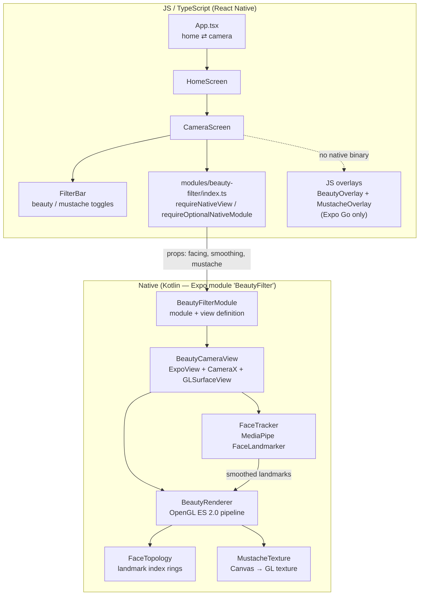
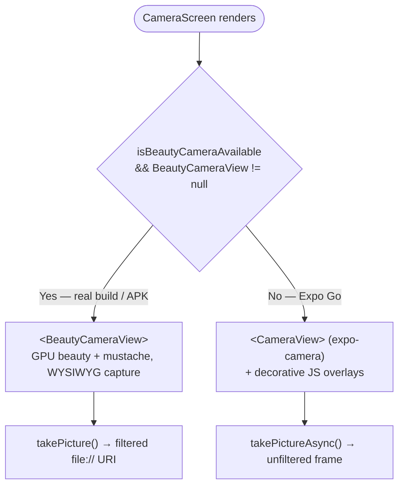
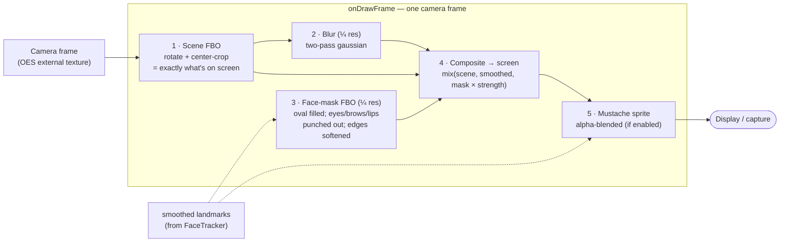
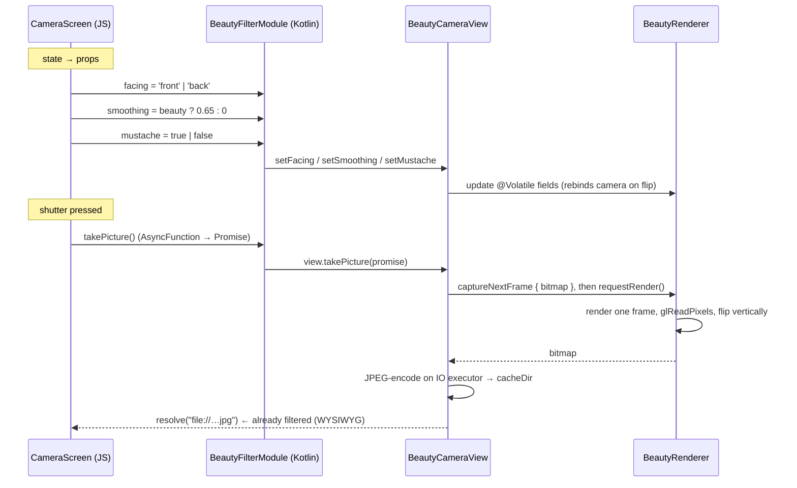

# FilterCam — Architecture

FilterCam is an Expo (React Native) camera app whose real work happens in a
**local Expo native module written in Kotlin** (`modules/beauty-filter`). The
JS side is a thin UI shell; the native side owns the camera, face tracking, and
an OpenGL render pipeline that applies a face-only beauty filter and a
landmark-anchored mustache in real time.

- **Platform:** Android only. (The old iOS Swift module was removed.)
- **JS ↔ native contract:** a single `<BeautyCameraView>` component plus a
  `takePicture()` method, wired through the Expo Modules API.

---

## 1. Layers at a glance



**Key files**

| File | Responsibility |
|------|----------------|
| `App.tsx` | Two-screen switch (home ⇄ camera), no router |
| `src/screens/CameraScreen.tsx` | Permissions, filter state, native-vs-fallback choice, shutter |
| `src/components/FilterBar.tsx` | Beauty / Mustache toggle chips |
| `modules/beauty-filter/index.ts` | JS view/module bridge + `isBeautyCameraAvailable` |
| `src/native/beautyFilter.ts` | `applyBeauty` bridge (no-op on Android, kept for parity) |
| `…/beautyfilter/BeautyFilterModule.kt` | Declares module name, props, `takePicture` |
| `…/beautyfilter/BeautyCameraView.kt` | Hosts `GLSurfaceView`, binds CameraX preview + analysis |
| `…/beautyfilter/FaceTracker.kt` | MediaPipe 478-point mesh, live-stream + smoothing |
| `…/beautyfilter/BeautyRenderer.kt` | The GL pipeline + all shaders |
| `…/beautyfilter/FaceTopology.kt` | Landmark index rings (oval, eyes, brows, lips, nose) |
| `…/beautyfilter/MustacheTexture.kt` | Draws the mustache sprite, uploads as a texture |
| `…/assets/face_landmarker.task` | MediaPipe face-mesh model (~3.6 MB) |

---

## 2. Native or fallback? (why Expo Go shows a plain camera)

The Kotlin module is only present in a **dev/EAS/APK build** — never in Expo Go.
`requireOptionalNativeModule('BeautyFilter')` returns `null` when the binary
doesn't contain it, and the UI branches on that.



Because you built and installed the APK, your device runs the **left branch**.

---

## 3. The render pipeline (per frame)

`BeautyRenderer` runs on the `GLSurfaceView` GL thread in
`RENDERMODE_WHEN_DIRTY` — it only draws when a new camera frame arrives (or on
capture). Camera pixels stay on the GPU the whole time (an OES external
texture), so nothing is copied back to the CPU for the live view.



Notes that make it fast and stable:

- **Quarter-resolution** blur and mask passes — the expensive work runs on
  ¼ × ¼ = 1/16 of the pixels.
- The **mask** is built from `FaceTopology` rings drawn as triangle fans: the
  face oval is filled white, then eyes/brows/lips are drawn black (slightly
  inflated) so smoothing never touches them. It's then blurred for a soft edge.
- The **composite** shader blends the sharp scene toward the blurred version
  only where the mask is white, scaled by `smoothing` (the `smoothing` prop).
  It also lifts brightness/contrast very slightly for a "glow".
- Landmarks older than **400 ms** are treated as stale and dropped, so the
  filter fades out cleanly when the face leaves the frame.

---

## 4. Face tracking data flow (and the threads)

Three threads cooperate. CameraX delivers analysis frames on a dedicated
executor; MediaPipe runs in `LIVE_STREAM` mode and calls back asynchronously;
results are exponentially smoothed and handed to the renderer via `@Volatile`
fields.

```mermaid
sequenceDiagram
    participant Cam as CameraX ImageAnalysis<br/>(analysis executor)
    participant FT as FaceTracker
    participant MP as MediaPipe FaceLandmarker<br/>(GPU, CPU fallback)
    participant R as BeautyRenderer<br/>(GL thread)

    Cam->>FT: analyze(ImageProxy) — RGBA, KEEP_ONLY_LATEST
    FT->>FT: rotate upright + mirror if front camera
    FT->>MP: detectAsync(bitmap, timestamp)
    Note over Cam,FT: proxy.close() → next frame can arrive
    MP-->>FT: onResult(478 landmarks) [async]
    FT->>FT: exponential smoothing (α=0.55)<br/>reset if gap &gt; 300 ms
    FT->>R: renderer.landmarks = smoothed<br/>renderer.landmarksAt = now
    R->>R: next onDrawFrame uses landmarks<br/>(if fresher than 400 ms)
```

Details worth knowing:

- **`STRATEGY_KEEP_ONLY_LATEST`** — if detection can't keep up, intermediate
  frames are dropped rather than queued, so tracking never lags behind the
  preview.
- **Front-camera mirroring** — the analysis bitmap is flipped horizontally to
  match the mirrored preview, so landmark coordinates line up with what the
  user sees.
- **GPU delegate with CPU fallback** — `FaceTracker` tries the GPU delegate
  first and silently falls back to CPU if unavailable.
- **Coordinate mapping** — landmarks are normalized in the *full upright camera
  frame*; the renderer remaps them into the visible (cropped) region via
  `cropOffX/Y` and `cropScaleX/Y` before drawing the mask and mustache.

---

## 5. Props and capture across the JS ↔ native boundary



The important guarantee: **capture goes through the same pipeline as the live
preview** (`glReadPixels` on the rendered frame), so the saved photo contains
exactly the beauty filter and mustache the user saw.

---

## 6. Build & run

This app **cannot run in Expo Go** (it has a custom native module). Use one of:

```bash
# Local dev with the native module
npx expo run:android

# Standalone release APK (what was built for device testing)
cd android && ./gradlew assembleRelease
#   → android/app/build/outputs/apk/release/app-release.apk

# Or cloud build via EAS
eas build --platform android --profile preview
```

> The release APK is signed with the debug keystore (see
> `android/app/build.gradle`) — fine for personal testing, not for the Play
> Store. Store distribution needs a real release keystore (EAS can manage one).

See the repo `README.md` for a shorter feature-level overview.
