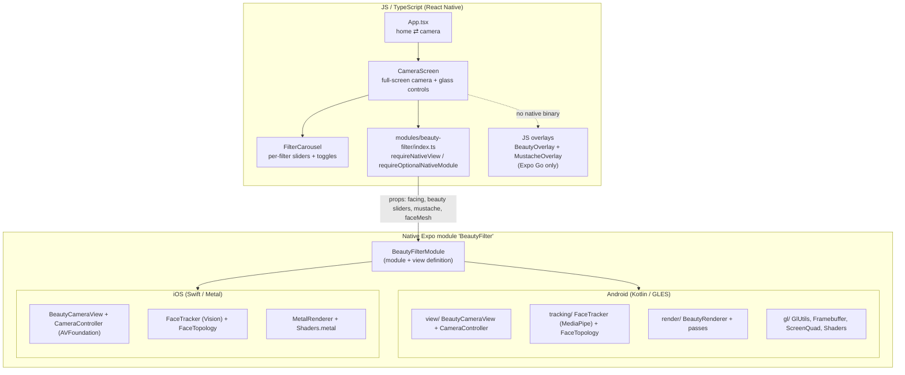
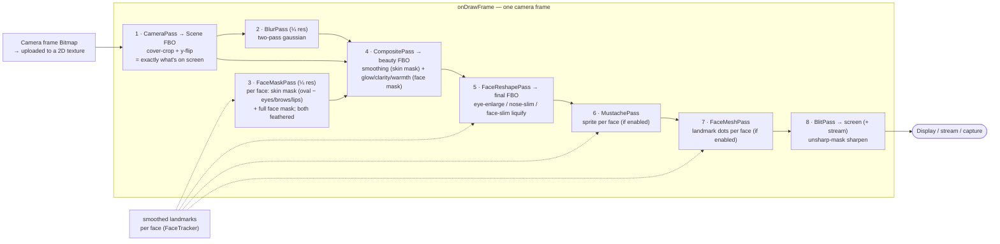
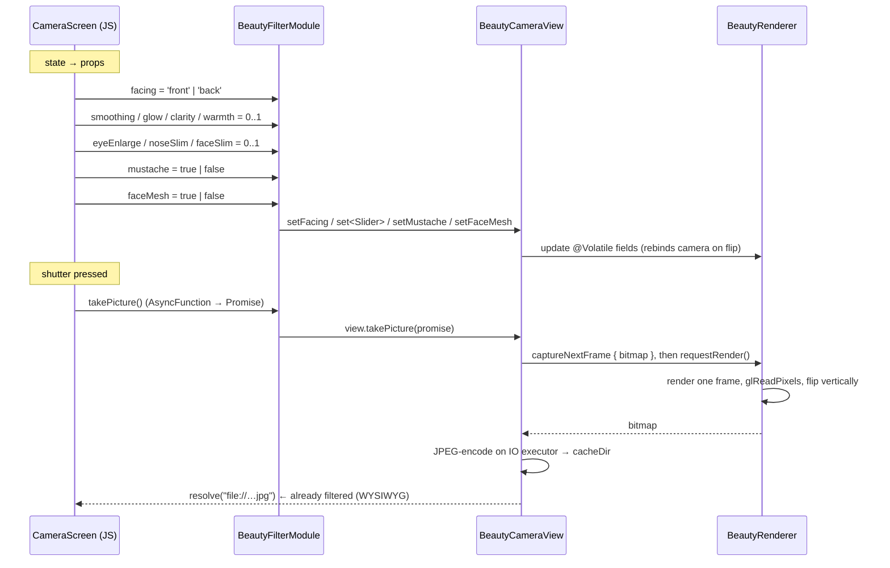

# FilterCam — Architecture

FilterCam is an Expo (React Native) camera app whose real work happens in a
**local Expo native module** (`modules/beauty-filter`). The JS side is a thin UI
shell; the native side owns the camera, face tracking, and a GPU render pipeline
that applies a face-only beauty filter, a landmark-anchored mustache, and an
optional face-mesh debug overlay in real time.

- **Platforms:** Android (Kotlin + OpenGL ES) and iOS (Swift + Metal + Vision).
  Both implement the same JS-facing contract; the Android side is the reference.
- **JS ↔ native contract:** a single `<BeautyCameraView>` component (props
  `facing`; the beauty sliders `smoothing`, `glow`, `clarity`, `warmth`,
  `eyeEnlarge`, `noseSlim`, `faceSlim`; and the toggles `mustache`, `faceMesh`)
  plus a `takePicture()` method, wired through the Expo Modules API.
- **Multi-face:** up to 5 faces are tracked and filtered at once.

---

## 1. Layers at a glance



**Key files (Android)**

| File | Responsibility |
|------|----------------|
| `App.tsx` | Two-screen switch (home ⇄ camera), no router |
| `src/screens/CameraScreen.tsx` | Permissions, filter state, full-screen camera, glass (blur) controls, framing, face-mesh toggle |
| `src/components/FilterCarousel.tsx` | Per-filter sliders (smooth/glow/clarity/warm/eyes/nose/slim) + mustache/face-mesh toggles |
| `modules/beauty-filter/index.ts` | JS view/module bridge + `isBeautyCameraAvailable` |
| `…/beautyfilter/BeautyFilterModule.kt` | Declares module name, props, `takePicture` (wiring only) |
| `…/beautyfilter/view/BeautyCameraView.kt` | ExpoView; hosts `GLSurfaceView`, wires camera → tracker → renderer, capture, stream surface |
| `…/beautyfilter/view/CameraController.kt` | CameraX binding — a single `ImageAnalysis` stream (no Preview use case) |
| `…/beautyfilter/tracking/FaceTracker.kt` | MediaPipe 478-point mesh in VIDEO mode on a dedicated detection thread, decoupled from display; multi-face, per-face smoothing |
| `…/beautyfilter/tracking/FaceTopology.kt` | Landmark index rings (oval, eyes, brows, lips) + mustache/reshape anchors |
| `…/beautyfilter/render/BeautyRenderer.kt` | GL-thread orchestrator of the per-frame passes |
| `…/beautyfilter/render/BeautyAdjustments.kt` | Value object holding the seven beauty-slider strengths (clamped 0..1) |
| `…/beautyfilter/render/*Pass.kt` | One class per pass: Camera, Blur, FaceMask, Composite, FaceReshape, Mustache, FaceMesh, Blit |
| `…/beautyfilter/render/StreamOutput.kt` | GPU-resident push of each filtered frame to an external `Surface` (LiveKit/WebRTC seam) |
| `…/beautyfilter/render/Viewport.kt` | Crop (cover) + landmark→screen coordinate mapping |
| `…/beautyfilter/render/MustacheTexture.kt` | Draws the mustache sprite, uploads as a texture |
| `…/beautyfilter/gl/*.kt` | GL primitives: `GlUtils`, `Framebuffer`, `ScreenQuad`, `Shaders` |
| `…/assets/face_landmarker.task` | MediaPipe face-mesh model (~3.7 MB) |

**Key files (iOS)** — see `modules/beauty-filter/ios/README-ios.md` for detail.
`BeautyFilterModule.swift` (Expo module), `BeautyCameraView.swift` (ExpoView),
`CameraController.swift` (AVFoundation), `FaceTracker.swift` (Vision),
`FaceTopology.swift`, `MetalRenderer.swift`, `MustacheTexture.swift`,
`Shaders.metal`. iOS uses Apple **Vision** for landmarks (a coarser set than
MediaPipe's 478-mesh) and **Metal** for the render passes.

### Android package layout (the restructure)

Responsibilities are split into four sub-packages so each file reads as a single
concern rather than one monolithic renderer:

```
com.haywan.filtercam.beautyfilter
├── BeautyFilterModule.kt      # Expo wiring only
├── view/                      # RN view + camera plumbing
│   ├── BeautyCameraView.kt
│   └── CameraController.kt
├── tracking/                  # face landmarks
│   ├── FaceTracker.kt
│   └── FaceTopology.kt
├── render/                    # GL-thread rendering
│   ├── BeautyRenderer.kt      # orchestrator
│   ├── BeautyAdjustments.kt   # the seven slider strengths
│   ├── Viewport.kt            # crop + coordinate mapping
│   ├── CameraPass / BlurPass / FaceMaskPass
│   ├── CompositePass / FaceReshapePass
│   ├── MustachePass / FaceMeshPass / BlitPass
│   ├── StreamOutput.kt        # GPU-resident stream surface
│   └── MustacheTexture.kt
└── gl/                        # GL primitives
    ├── GlUtils.kt  Framebuffer.kt
    ├── ScreenQuad.kt  Shaders.kt
```

---

## 2. Native or fallback? (why Expo Go shows a plain camera)

The native module is only present in a **dev/EAS/APK build** — never in Expo Go.
`requireOptionalNativeModule('BeautyFilter')` returns `null` when the binary
doesn't contain it, and the UI branches on that. This is true on both platforms.


---

## 3. The render pipeline (per frame)

On Android `BeautyRenderer` runs on the `GLSurfaceView` GL thread in
`RENDERMODE_WHEN_DIRTY` — it only draws when a new camera frame arrives (or on
capture). Each analysis frame is delivered as an RGBA `Bitmap` (already rotated
upright and mirrored by `FaceTracker`), uploaded to a 2D texture at the top of
`onDrawFrame`, and then filtered entirely on the GPU through a chain of FBO
passes. Each numbered step is its own `*Pass` class; the renderer just calls them
in order.



Notes that make it fast and stable:

- **Quarter-resolution** blur and mask passes — the expensive work runs on
  ¼ × ¼ = 1/16 of the pixels.
- **Cover-crop** (`Viewport`): the camera 4:3 frame is center-cropped to fill the
  view with no letterbox bars. The frame is already upright when it reaches the
  renderer (`FaceTracker` applies `imageInfo.rotationDegrees` + front-camera
  mirror with `filter=false`, a pixel-exact rotate), so `CameraPass` only crops
  and y-flips — there is no empirical rotation offset.
- **Two masks** are built from `FaceTopology` rings drawn as triangle fans, **for
  every tracked face**, both feathered with an edge blur:
  - the **skin mask** — the face oval filled white with eyes/brows/lips punched
    black — gates *smoothing only*, so features stay sharp;
  - the **full face mask** — the oval with nothing punched out — gates the
    *tone/light* adjustments so the whole face (eyes, lips, beard included)
    brightens uniformly instead of leaving those regions looking shaded.
- The **composite** shader blends the sharp scene toward the blurred version
  inside the skin mask (scaled by `smoothing`), and applies `glow` (brightness +
  highlight bloom), `clarity` (even tone / redness reduction) and `warmth` inside
  the face mask.
- **FaceReshapePass** liquifies the composited image — enlarging eyes, narrowing
  the nose, slimming the jaw — by warping sampled UVs around inter-eye-scaled
  regions. With all three strengths at 0 it degrades to a plain blit, so it is
  always safe in the chain.
- **BlitPass** presents the final texture with a light unsharp-mask sharpen (the
  frame is upscaled from the analysis resolution, so this restores acutance) to
  both the screen and, when attached, the stream surface (§4).

---

## 4. Face tracking data flow (and the threads)

Three threads cooperate, and — this is the key design point — **display and
detection are decoupled**. Every analysis frame is rotated upright and sent
straight to the renderer for display, so the preview runs at the full camera
frame rate; detection is *not* on that path. A downscaled copy of each frame is
dropped into a single-slot buffer that a dedicated `FaceDetect` thread consumes
as fast as it can (MediaPipe in `RunningMode.VIDEO`), publishing per-face
smoothed landmarks back to the renderer via `@Volatile` fields.

```mermaid
sequenceDiagram
    participant Cam as CameraX ImageAnalysis (analysis executor)
    participant FT as FaceTracker
    participant DT as FaceDetect thread
    participant MP as MediaPipe FaceLandmarker (GPU, CPU fallback)
    participant R as BeautyRenderer (GL thread)

    Cam->>FT: analyze(ImageProxy) — RGBA, KEEP_ONLY_LATEST
    FT->>FT: rotate upright + mirror if front camera (filter=false)
    FT->>DT: submit downscaled copy (640px long side, single-slot; drop stale)
    FT->>R: submitFrame(upright bitmap) → requestRender()  [full FPS]
    DT->>MP: detectForVideo(bitmap, videoTs++)
    MP-->>DT: up to 5 faces × 478 normalized landmarks
    DT->>DT: per-face adaptive smoothing; reset on face-count change
    DT->>R: setFaces(Array&lt;FloatArray&gt;)
    R->>R: next onDrawFrame filters the newest frame with the newest landmarks
```

Details worth knowing:

- **Decoupled display + detection** — the preview never waits for MediaPipe. If
  detection can't keep up it processes the latest frame and skips the rest; during
  fast motion the landmarks may lag the displayed frame by a frame or two, which
  the per-frame smoothing keeps from looking jittery.
- **Detection resolution** — landmarks are normalized (0..1), so detection runs on
  a cheap 640px-long-side copy while the preview stays at the full analysis
  resolution; the coordinates still map 1:1.
- **`STRATEGY_KEEP_ONLY_LATEST`** — CameraX drops intermediate analysis frames
  rather than queuing them, so the pipeline always works on the freshest frame.
- **Multi-face** — each detected face is emitted as its own `FloatArray`; the
  frame is `Array<FloatArray>` (empty = no faces). Smoothing is per face index and
  resets when the face count changes (ordering isn't stable across that boundary).
- **Adaptive landmark smoothing** — a low base smoothing takes the jitter off,
  but the factor rises with per-point motion so the landmarks snap to the current
  frame during real movement instead of dragging.
- **Front-camera mirroring** — the frame is flipped horizontally (about its
  centre, combined with the upright rotation) so landmark coordinates line up with
  the mirrored selfie preview.
- **GPU delegate with CPU fallback** — `FaceTracker` tries the GPU delegate first
  and silently falls back to CPU if unavailable.
- **Coordinate mapping** — `Viewport` remaps normalized upright landmarks into the
  visible (cropped) region for the masks, reshape, mustache and mesh dots.

---

## 5. Props and capture across the JS ↔ native boundary



The important guarantee: **capture goes through the same pipeline as the live
preview** (`glReadPixels` on the rendered frame), so the saved photo contains
exactly the beauty filter and mustache the user saw.

---

## 6. iOS vs Android

Both platforms implement the identical JS contract, but the internals differ:

| Concern | Android | iOS |
|---------|---------|-----|
| Camera | CameraX (single `ImageAnalysis` stream) | AVFoundation (`AVCaptureVideoDataOutput`) |
| Face landmarks | MediaPipe FaceLandmarker, **478-point mesh** | Apple **Vision** `VNDetectFaceLandmarksRequest` (coarser regions) |
| GPU render | OpenGL ES 2.0 + GLSL | Metal + `Shaders.metal` |
| Mask source | dense mesh rings | face contour + eyes/brows/lips regions (synthesized oval) |

Because Vision returns fewer, region-based landmarks, the iOS face-oval mask is
synthesized from the jaw contour plus eyebrows; see `ios/README-ios.md` for the
differences and the first-build checklist (camera usage description, metallib
bundling, on-device testing only).

---

## 7. Build & run

This app **cannot run in Expo Go** (it has a custom native module). Use one of:

```bash
# Local dev with the native module
npx expo run:android          # or: npx expo run:ios   (needs a Mac + Xcode)

# Standalone release APK (arm64, ~52 MB)
cd android && ./gradlew assembleRelease -PreactNativeArchitectures=arm64-v8a
#   → android/app/build/outputs/apk/release/app-release.apk

# Cloud build via EAS
eas build --platform android --profile preview
```

> The release APK is signed with the debug keystore (see
> `android/app/build.gradle`) — fine for personal testing, not for the Play
> Store. Store distribution needs a real release keystore (EAS can manage one).
